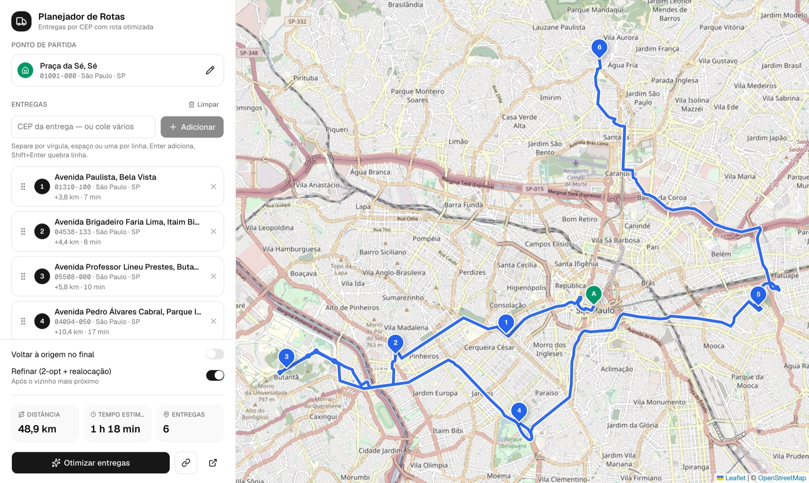
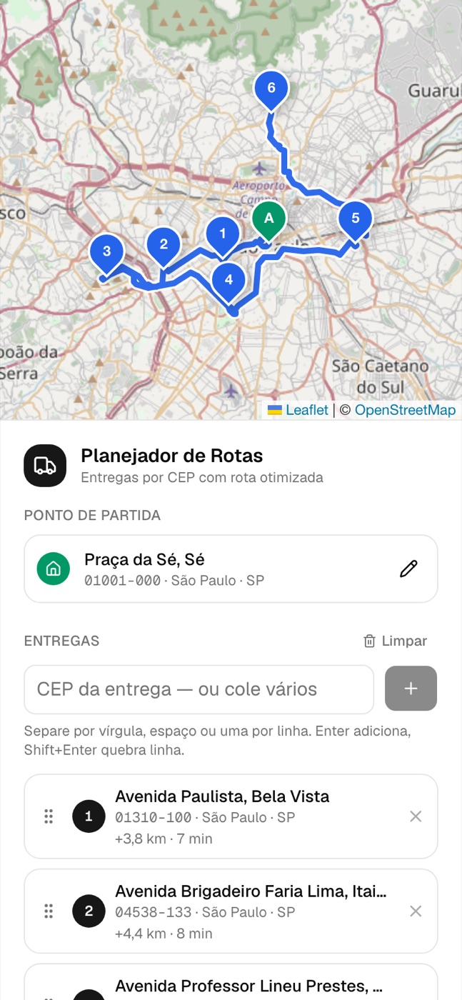
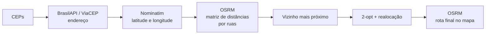

<div align="center">

# 🚚 Planejador de Rotas por CEP

**Monte rotas de entrega a partir de CEPs brasileiros, otimize a ordem das paradas e veja tudo no mapa.**
Gratuito, open source e sem chave de API.

[](https://github.com/vinimatheus/planejador-de-rotas/actions/workflows/ci.yml)
[](LICENSE)


[](CONTRIBUTING.md)

[Funcionalidades](#-funcionalidades) ·
[Começar](#-começando-em-2-minutos) ·
[Como a otimização funciona](#-como-a-otimização-funciona) ·
[API](#-api) ·
[Roadmap](#-roadmap) ·
[English](#-english)



</div>

## ✨ Funcionalidades

- 📍 **CEP de origem** e **várias entregas por CEP** — digite um ou **cole uma lista inteira** (da planilha, separada por vírgula, espaço, `;` ou uma por linha)
- 🧠 **Otimização da ordem das entregas** (Problema do Caixeiro Viajante — vizinho mais próximo + 2-opt)
- 🛣️ **Rota por ruas reais** desenhada no mapa com [OSRM](https://project-osrm.org/), não linha reta
- 📊 **Distância e tempo total**, e quanto cada trecho soma
- ✋ **Arrastar e soltar** para mudar a ordem manualmente — a rota é recalculada na hora
- 🔗 **Link compartilhável** da rota e botão para **abrir no Google Maps** e sair navegando
- ⚠️ Avisa quando um CEP não existe ou foi localizado só pelo centro da cidade
- 📱 **Responsivo**: mapa em cima no celular, painel lateral no desktop
- 🆓 **Sem chave de API e sem cadastro**: usa BrasilAPI, ViaCEP, OpenStreetMap e OSRM

<p align="center">
  
</p>

### Experimente com um link

Com o projeto rodando, este link já carrega 6 entregas em São Paulo e otimiza sozinho:

```
http://localhost:3000/?origem=01001000&entregas=05508000,04538133,02011000,04094050,03178200,01310100&otimizar=1
```

| Parâmetro  | Exemplo                 | O que faz                        |
| ---------- | ----------------------- | -------------------------------- |
| `origem`   | `01001000`              | CEP de partida                   |
| `entregas` | `05508000,04538133`     | CEPs das entregas, por vírgula   |
| `volta`    | `1`                     | Volta para a origem no final     |
| `otimizar` | `1`                     | Otimiza a ordem assim que carrega |

## 🚀 Começando em 2 minutos

Pré-requisitos: **Node.js 20+** e **pnpm 9+**.

```bash
git clone https://github.com/vinimatheus/planejador-de-rotas.git
cd planejador-de-rotas
pnpm install
pnpm dev
```

Abra **http://localhost:3000**. A API sobe em **http://localhost:3333**.

Os arquivos `.env` são opcionais — os padrões já funcionam. Para personalizar:

```bash
cp apps/api/.env.example apps/api/.env
cp apps/web/.env.example apps/web/.env.local
```

| Comando          | O que faz                                  |
| ---------------- | ------------------------------------------ |
| `pnpm dev`       | Sobe web + API com hot reload (Turborepo)  |
| `pnpm test`      | Testes do algoritmo e da API               |
| `pnpm typecheck` | Verificação de tipos em todo o monorepo    |
| `pnpm build`     | Build de produção                          |

## 🧱 Stack

| Camada      | Tecnologia |
| ----------- | ---------- |
| Monorepo    | [Turborepo](https://turbo.build) + pnpm workspaces |
| Front-end   | [Next.js 16](https://nextjs.org) (App Router), React 19, [Tailwind CSS 4](https://tailwindcss.com), [shadcn/ui](https://ui.shadcn.com) |
| Mapa        | [Leaflet](https://leafletjs.com) + [react-leaflet](https://react-leaflet.js.org), tiles do [OpenStreetMap](https://www.openstreetmap.org) |
| Drag & drop | [@hello-pangea/dnd](https://github.com/hello-pangea/dnd) |
| API         | [Fastify 5](https://fastify.dev) |
| Validação   | [zod](https://zod.dev) — os mesmos schemas no front e na API |
| Rotas       | [OSRM](https://project-osrm.org) (matriz de distâncias e geometria) |
| CEP         | [BrasilAPI](https://brasilapi.com.br) → [ViaCEP](https://viacep.com.br) → [Nominatim](https://nominatim.org) |

```
apps/
  web/       Next.js: interface, mapa e estado da rota
  api/       Fastify: /cep/:cep, /routes, /routes/optimize
packages/
  shared/    schemas zod, algoritmo TSP, haversine e formatadores
```

## 🧠 Como a otimização funciona

Achar a melhor ordem de entregas é o **Problema do Caixeiro Viajante (TSP)**. A solução exata cresce em fatorial (10 entregas = 3,6 milhões de ordens possíveis), então o projeto usa heurísticas rápidas que dão rotas muito boas em milissegundos:



1. **Matriz de distâncias reais.** O OSRM calcula a distância *por ruas* entre todos os pares de pontos (inclusive mão única).
2. **Vizinho mais próximo.** Saindo da origem, vai sempre para a entrega ainda não visitada mais próxima. É O(n²) e dá uma boa primeira rota.
3. **Refinamento (opcional, ligado por padrão).** Uma busca local melhora a rota enquanto houver ganho:
   - **2-opt** inverte um trecho da rota, desfazendo "cruzamentos";
   - **realocação** tira uma entrega do lugar e a coloca em outra posição.
4. **Rota final.** O OSRM devolve a geometria e o tempo de cada trecho para desenhar no mapa.

Nos testes com entregas em São Paulo, otimizar encurtou a rota em **até 9 km** em relação à ordem digitada. O código está em [`packages/shared/src/tsp.ts`](packages/shared/src/tsp.ts), com testes.

**E se o OSRM cair?** A API usa distância em linha reta × 1,3 a 30 km/h como estimativa, e o mapa mostra a linha tracejada com um aviso.

## 🔌 API

A API é independente do front — dá para usar em outros sistemas.

<details>
<summary><code>GET /cep/:cep</code> — endereço e coordenadas de um CEP</summary>

```bash
curl http://localhost:3333/cep/01310100
```

```json
{
  "cep": "01310100",
  "street": "Avenida Paulista",
  "neighborhood": "Bela Vista",
  "city": "São Paulo",
  "state": "SP",
  "coordinates": { "lat": -23.5575, "lng": -46.6606 },
  "geocodeSource": "nominatim-street"
}
```

`geocodeSource` diz a precisão: `nominatim-street` (rua), `brasilapi`, ou `nominatim-city` (só o centro da cidade). CEP inexistente retorna `404`.
</details>

<details>
<summary><code>POST /routes/optimize</code> — otimiza a ordem e traça a rota</summary>

```bash
curl -X POST http://localhost:3333/routes/optimize \
  -H 'content-type: application/json' \
  -d '{
    "origin": { "id": "sede", "coordinates": { "lat": -23.5504, "lng": -46.6331 } },
    "stops": [
      { "id": "a", "coordinates": { "lat": -23.5633, "lng": -46.6944 } },
      { "id": "b", "coordinates": { "lat": -23.5576, "lng": -46.6606 } }
    ],
    "returnToOrigin": false,
    "improve": true
  }'
```

Resposta: `order` (ids na ordem de visita), `distance` (m), `duration` (s), `legs` (cada trecho), `geometry` (polilinha `[lat, lng]`) e `source` (`osrm` ou `haversine`). Até 40 entregas por rota.
</details>

<details>
<summary><code>POST /routes</code> — traça a rota na ordem enviada</summary>

Mesmo corpo do `/routes/optimize` (sem `improve`), mas respeita a ordem de `stops`.
</details>

## ☁️ Produção

Os serviços públicos gratuitos são ótimos para testar, mas têm limites de uso:

- **OSRM**: suba o seu com Docker e o [extrato do Brasil da Geofabrik](https://download.geofabrik.de/south-america/brazil.html) e aponte `OSRM_URL`.
- **Tiles do mapa**: troque `NEXT_PUBLIC_TILE_URL` por um provedor (MapTiler, Stadia, Thunderforest…) — os do OSM têm [política de uso justo](https://operations.osmfoundation.org/policies/tiles/).
- **Nominatim**: configure `NOMINATIM_USER_AGENT` com um contato real (exigência deles) ou use uma instância própria em `NOMINATIM_URL`.
- **Web**: defina `NEXT_PUBLIC_API_URL` com o endereço da API; na API, `CORS_ORIGIN` com o domínio do front.

## 🗺️ Roadmap

- [ ] Importar entregas de CSV/Excel com nome do cliente e número
- [ ] Endereço completo (rua + número) além do CEP
- [ ] Janelas de horário por entrega
- [ ] Vários veículos (VRP) e capacidade de carga
- [ ] Exportar a rota em PDF para o motorista
- [ ] Deploy com um clique (Vercel + Fly.io)

Quer ajudar com algum? Veja o [guia de contribuição](CONTRIBUTING.md).

## 🌎 English

**Delivery route planner for Brazilian postal codes (CEP).** Enter an origin and many delivery CEPs (paste a whole list), and it geocodes them, optimizes the stop order with a Traveling Salesman heuristic (nearest neighbor + 2-opt / relocation over a real road-distance matrix from OSRM), and draws the route on a Leaflet map with total distance and time. Drag & drop to reorder, share the route as a link, or open it in Google Maps. No API keys required.

Built with Turborepo, Next.js 16, React 19, Tailwind CSS 4, shadcn/ui, Leaflet, Fastify 5, zod and OSRM. Run it with `pnpm install && pnpm dev`.

## ⭐ Gostou?

Se o projeto te ajudou, **deixe uma estrela** — isso ajuda outras pessoas a encontrá-lo.
Achou um bug ou tem uma ideia? [Abra uma issue](https://github.com/vinimatheus/planejador-de-rotas/issues).

## 📄 Licença

[MIT](LICENSE) © Vinícius Matheus Moreira

Dados de mapa © colaboradores do [OpenStreetMap](https://www.openstreetmap.org/copyright).
